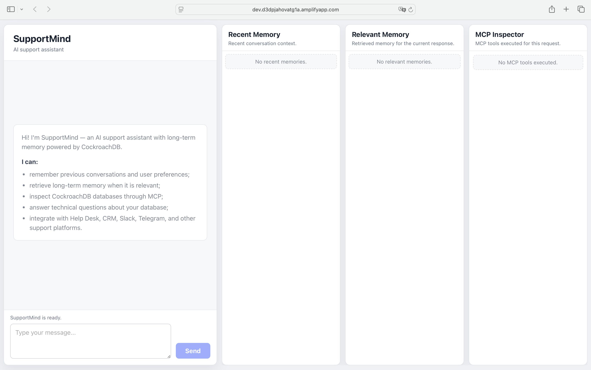
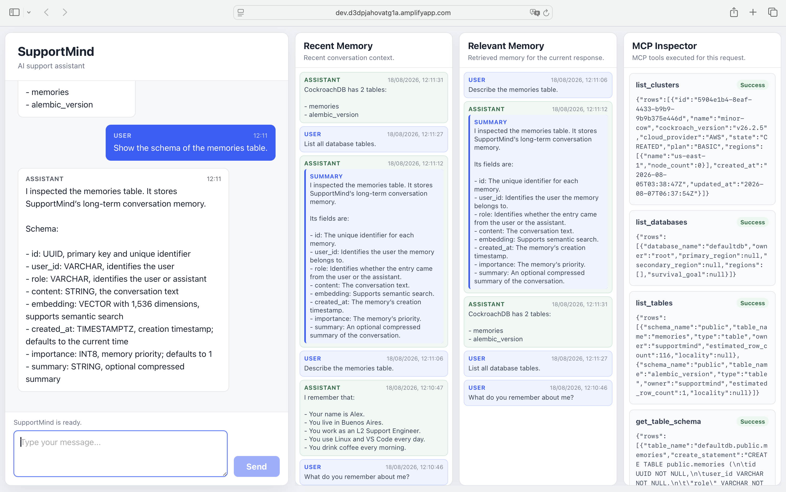

# SupportMind

AI Support Assistant with Long-Term Memory powered by CockroachDB.

SupportMind combines conversational memory, semantic retrieval, and CockroachDB MCP tools to help support engineers retain context across interactions and inspect database information through natural-language requests.

## Why SupportMind

Support engineers often need to remember previous conversations, user preferences and technical context while also inspecting backend systems.

SupportMind combines long-term memory, semantic retrieval and CockroachDB MCP tools to provide context-aware assistance through natural language.

## Screenshots

### Home



### End of Demo



## Live Demo

### Demo Application

https://dev.d3dpjahovatg1a.amplifyapp.com

### Demo Video

https://youtu.be/9dpcoeqTa1U

## Source Code

https://github.com/AinurMunasipov/supportmind

## Features

- Long-term conversational memory scoped by user.
- Semantic memory retrieval using stored vector embeddings.
- Persistent storage in CockroachDB through SQLAlchemy.
- Natural-language database inspection using CockroachDB MCP.
- Transparent visualization of recent memory, relevant memory, and MCP results.
- Duplicate memory prevention through normalized content comparison.
- Memory importance and summary support.
- A responsive React interface for chat and runtime context inspection.
- A Dockerized FastAPI backend.
- Designed for future Help Desk, CRM, Slack, and Telegram integrations.

## Architecture

The diagram below illustrates how SupportMind combines AWS services, CockroachDB persistent memory, semantic retrieval, and CockroachDB Managed MCP to answer user requests.



### Frontend

The React and TypeScript frontend provides the chat experience and read-only inspectors for memory and MCP execution results. It communicates with the backend through the `/chat` API and reads the backend URL from `VITE_API_URL`.

### FastAPI Backend

FastAPI exposes chat and memory endpoints, validates request and response models, and coordinates the application services. The backend keeps context selection, prompt construction, OpenAI calls, persistence, and MCP execution in separate service modules.

### Memory Service

The Memory Service stores conversations, prevents normalized duplicates, loads recent context, and performs semantic similarity searches. Each memory is associated with a `user_id`, role, content, embedding, creation time, importance value, and optional summary.

### OpenAI

OpenAI generates 1,536-dimensional embeddings with `text-embedding-3-small` and produces assistant responses from the assembled context. The model receives recent memory, relevant memory, MCP results, and the current user message in a predictable order.

### CockroachDB

CockroachDB is the durable memory store and contains the vector representation used by semantic retrieval. SQLAlchemy and the CockroachDB dialect provide application access, while Alembic manages incremental schema changes.

### CockroachDB MCP

The official Python MCP SDK connects to the CockroachDB Cloud MCP server over streamable HTTP. The current workflow discovers available tools and can execute `list_clusters`, `list_databases`, `list_tables`, and `get_table_schema`.

## How It Works

1. A user sends a message through the React chat interface.
2. The FastAPI backend loads the user's recent memories.
3. A typed retrieval decision determines whether semantic memory search is needed.
4. When needed, the query is embedded and compared with stored CockroachDB vectors.
5. A separate decision determines whether the message requires CockroachDB MCP.
6. Database-oriented requests enter the existing table inspection workflow.
7. The workflow calls the required MCP tools and preserves their chronological results.
8. PromptBuilder assembles system instructions, recent memory, relevant memory, MCP context, and the current request.
9. OpenAI generates a concise response grounded in the available context.
10. Non-trivial interactions are stored as long-term memory.
11. The API returns the response together with the runtime memory and MCP context used by the frontend inspectors.

## Memory System

### Recent Memory

Recent Memory preserves the latest conversation context so the assistant can maintain continuity between messages.

### Relevant Memory

Relevant Memory uses semantic search to retrieve prior information that can help answer the current request.

### Long-Term Memory

Long-Term Memory persists conversations and user context in CockroachDB across requests, browser sessions, and application restarts.

### Memory Summaries

Memory summaries provide a compact representation of stored context when a summary is available.

### Memory Inspector

The frontend displays Recent Memory and Relevant Memory in separate, independently scrollable panels.

Each item shows its role, creation time, and either its summary or original content.

### MCP Inspector

The MCP Inspector displays every executed MCP tool in chronological order, including its success state and raw returned content.

It is intentionally a debugging view; the normal chat response presents the same successful data in a concise, human-readable form.

## MCP Integration

SupportMind uses lightweight keyword matching to decide whether database inspection is required.

Normal conversation, including a message such as `Hello`, does not call MCP.

Requests about databases, tables, schemas, columns, or table structures enter the MCP workflow.

The current table workflow executes:

1. `list_clusters`
2. `list_databases`
3. `list_tables`
4. `get_table_schema`

Each operation produces a typed `ToolResult` that is passed both to PromptBuilder and to the frontend inspector.

Failures remain visible as diagnostic results. For database questions, the assistant is instructed not to invent information when CockroachDB cannot be queried.

MCP credentials are supplied at runtime and are never embedded in the application image.

## Tech Stack

| Category | Technology |
|----------|------------|
| Backend | FastAPI |
| Frontend | React |
| AI | OpenAI |
| Database | CockroachDB |
| Memory | CockroachDB Vector Search |
| MCP | CockroachDB Cloud Managed MCP Server |
| Deployment | Amazon ECS, Amazon ECR, AWS Amplify |
| Containerization | Docker |

The backend uses Python, SQLAlchemy, Alembic, Pydantic, Uvicorn, HTTPX, Psycopg, and the official Python MCP SDK v2. The frontend uses React, TypeScript, Vite, and plain CSS.

## Hackathon Technologies

### CockroachDB

- Persistent Memory
- Distributed Vector Search
- CockroachDB Cloud Managed MCP Server

### AWS

- Amazon ECS
- Amazon ECR
- AWS Amplify

## Project Structure

```text
.
├── README.md
├── ARCHITECTURE.md
├── PROJECT.md
├── LICENSE
├── backend
│   ├── Dockerfile
│   ├── alembic.ini
│   ├── alembic
│   │   ├── env.py
│   │   └── versions
│   │       ├── 20260815_0001_add_memory_importance.py
│   │       └── 20260815_0002_add_memory_summary.py
│   ├── app
│   │   ├── api
│   │   │   ├── chat.py
│   │   │   └── memory.py
│   │   ├── core
│   │   │   ├── config.py
│   │   │   └── prompts.py
│   │   ├── db
│   │   ├── models
│   │   ├── repositories
│   │   ├── schemas
│   │   ├── services
│   │   └── main.py
│   ├── scripts
│   │   ├── inspect_mcp.py
│   │   └── test_workflow.py
│   └── requirements.txt
└── frontend
    ├── public
    ├── src
    │   ├── api
    │   ├── components
    │   ├── types
    │   ├── App.tsx
    │   └── main.tsx
    ├── package.json
    └── vite.config.ts
```

## Quick Start

### Requirements

- Git
- A CockroachDB database with vector support
- An OpenAI API key
- CockroachDB MCP credentials for database inspection
- Python 3.11 or later for local backend development
- Node.js compatible with Vite 8
- Docker for the container workflow

### Clone the Repository

```bash
git clone https://github.com/AinurMunasipov/supportmind.git
cd supportmind
```

### Configure the Backend

```bash
cp backend/.env.example backend/.env
```

Set the following values in `backend/.env`:

```dotenv
DATABASE_URL=postgresql://<user>:<password>@<host>:26257/<database>?sslmode=verify-full
OPENAI_API_KEY=<openai-api-key>
COCKROACH_MCP_API_KEY=<cockroach-mcp-api-key>
COCKROACH_MCP_CLUSTER_ID=<optional-cluster-id>
```

`COCKROACH_MCP_CLUSTER_ID` is optional in the client, but a valid cluster context may be required by the CockroachDB MCP server.

### Install Backend Dependencies

```bash
cd backend
python -m venv .venv
source .venv/bin/activate
pip install -r requirements.txt
```

### Run the Backend Locally

```bash
uvicorn app.main:app --reload
```

### Run the Backend with Docker

From the `backend` directory:

```bash
docker build -t supportmind-backend .
docker run --env-file .env -p 8000:8000 supportmind-backend
```

### Configure and Run the Frontend

In a second terminal:

```bash
cd frontend
cp .env.example .env.local
npm ci
npm run dev
```

For local development, set:

```dotenv
VITE_API_URL=http://localhost:8000
```

### Local URLs

- Frontend: http://localhost:5173
- Backend: http://localhost:8000
- Swagger UI: http://localhost:8000/docs

## Example Conversation

### Long-Term Preference

```text
User: Remember that I prefer Linux.

User: What operating system do I prefer?

SupportMind: You prefer Linux.
```

The first interaction is stored in CockroachDB and can be retrieved as relevant context for the later question.

### Database Inspection

```text
User: Describe the memories table.

SupportMind inspects CockroachDB through MCP.

SupportMind: The memories table stores SupportMind's long-term conversation memory and includes fields for the user, role, conversation content, semantic embedding, creation time, importance, and optional summary.
```

The MCP Inspector retains the raw tool results while the chat presents a concise explanation.

## Future Work

- Help Desk integrations
- Slack
- Telegram
- CRM
- Multi-tenant organizations

## Project Status

Built for the CockroachDB × AWS Hackathon 2026.

## License

SupportMind is available under the [MIT License](LICENSE).

## Acknowledgements

- CockroachDB for durable SQL storage, vector capabilities, and the CockroachDB Cloud MCP server.
- AWS for the hackathon deployment platform.
- OpenAI for embeddings and response generation.

## Hackathon Requirements Coverage

| Requirement | Status |
|------------|--------|
| CockroachDB Persistent Memory | ✅ |
| Distributed Vector Search | ✅ |
| Cloud Managed MCP Server | ✅ |
| AWS Deployment | ✅ |
| Agentic Workflow | ✅ |
| Long-Term Memory | ✅ |
| Semantic Retrieval | ✅ |
